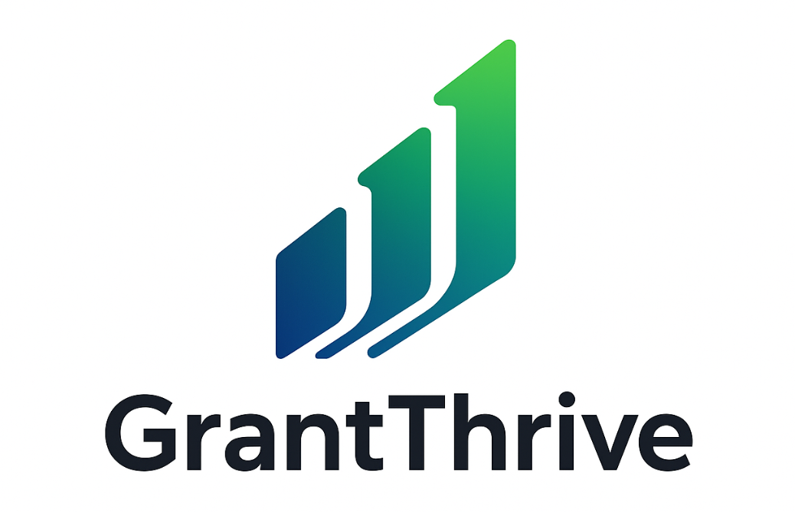

# GrantThrive Platform

**The Complete Grant Management Solution for Australian Councils and Communities**

GrantThrive is a modern, comprehensive grant management platform designed specifically for Australian local councils, philanthropic organizations, and community members. Built with cutting-edge technology and government-grade security, GrantThrive streamlines the entire grant lifecycle from application to approval.



## 🌟 Key Features

### For Councils
- **Complete Grant Management** - Create, manage, and track grants with full lifecycle support
- **Application Processing** - Streamlined review and approval workflows
- **Advanced Analytics** - Comprehensive reporting and insights dashboard
- **Role-Based Access** - Secure multi-level user management
- **Australian Compliance** - Built for Australian government requirements

### For Community Organizations
- **Easy Application Process** - Intuitive, mobile-friendly grant applications
- **Real-Time Tracking** - Monitor application status and progress
- **Document Management** - Secure upload and management of supporting documents
- **Professional Interface** - Clean, accessible design for all users

### For Administrators
- **Enterprise Security** - Government-grade security with audit logging
- **Comprehensive Reporting** - Advanced analytics and performance metrics
- **User Management** - Complete user and permission management
- **System Monitoring** - Health checks and performance monitoring

## 🏗️ Architecture

### Frontend
- **React 18** with modern hooks and context
- **Tailwind CSS** for responsive, professional styling
- **React Router** for seamless navigation
- **Recharts** for interactive data visualization
- **Mobile-first responsive design**

### Backend
- **Flask** with SQLAlchemy ORM
- **JWT Authentication** with role-based access control
- **SQLite/PostgreSQL** database support
- **RESTful API** with comprehensive endpoints
- **Enterprise security middleware**

### Security
- **JWT token-based authentication**
- **Role-based access control (RBAC)**
- **Input validation and sanitization**
- **Audit logging for compliance**
- **Rate limiting and security headers**
- **Australian data residency compliance**

## 🚀 Quick Start

### Prerequisites
- Node.js 18+ and npm/pnpm
- Python 3.8+ and pip
- Git

### Installation

1. **Clone the repository**
   ```bash
   git clone https://github.com/BigLittleBusiness/grantthrive-platform.git
   cd grantthrive-platform
   ```

2. **Set up the backend**
   ```bash
   cd backend
   pip install -r requirements.txt
   python src/main.py
   ```

3. **Set up the frontend**
   ```bash
   cd frontend
   npm install
   npm run dev
   ```

4. **Access the application**
   - Frontend: http://localhost:5173
   - Backend API: http://localhost:5000

### Demo Accounts

For testing purposes, you can use these demo accounts:

**Council Administrator:**
- Email: admin@melbourne.vic.gov.au
- Password: demo123

**Community User:**
- Email: community@example.org
- Password: demo123


## 📁 Project Structure

```
grantthrive-platform/
├── frontend/                 # React frontend application
│   ├── src/
│   │   ├── components/       # Reusable UI components
│   │   ├── contexts/         # React contexts for state management
│   │   ├── pages/           # Main application pages
│   │   ├── utils/           # Utility functions and API client
│   │   └── App.jsx          # Main application component
│   ├── public/              # Static assets
│   └── package.json         # Frontend dependencies
├── backend/                 # Flask backend application
│   ├── src/
│   │   ├── models/          # Database models
│   │   ├── routes/          # API route handlers
│   │   ├── middleware/      # Security and authentication middleware
│   │   ├── utils/           # Backend utilities
│   │   └── main.py          # Main Flask application
│   └── requirements.txt     # Backend dependencies
└── docs/                    # Comprehensive documentation
    ├── business/            # Business strategy and models
    ├── marketing/           # Marketing materials and brochures
    ├── sales/               # Sales tools and templates
    ├── deployment/          # Deployment guides and configurations
    └── logos/               # Brand assets and logos
```

## 🔐 Security Features

### Authentication & Authorization
- JWT token-based authentication with secure storage
- Role-based access control (Council Admin, Council Staff, Community User)
- Multi-level permission system with granular controls
- Secure password requirements with strength validation

### Data Protection
- Encryption utilities for sensitive data
- Input validation and sanitization to prevent XSS/injection attacks
- Australian-specific validation (phone numbers, ABN, email formats)
- Secure data comparison to prevent timing attacks

### Compliance & Monitoring
- Comprehensive audit logging for all system activities
- Rate limiting with configurable windows per endpoint
- Security event tracking with severity levels
- Complete audit trail for government compliance

## 📊 API Documentation

### Authentication Endpoints
- `POST /api/auth/register` - User registration
- `POST /api/auth/login` - User authentication
- `POST /api/auth/verify` - Token verification
- `POST /api/auth/refresh` - Token refresh

### Grant Management
- `GET /api/grants` - List grants with filtering
- `POST /api/grants` - Create new grant
- `GET /api/grants/{id}` - Get grant details
- `PUT /api/grants/{id}` - Update grant
- `DELETE /api/grants/{id}` - Delete grant

### Application Management
- `GET /api/applications` - List applications
- `POST /api/applications` - Submit application
- `GET /api/applications/{id}` - Get application details
- `PUT /api/applications/{id}/status` - Update status
- `GET /api/applications/stats` - Application statistics

### Analytics & Reporting
- `GET /api/analytics/overview` - Dashboard overview
- `GET /api/analytics/trends` - Trend analysis
- `GET /api/analytics/distribution` - Category distribution
- `GET /api/analytics/performance` - Performance metrics

## 🌏 Australian Compliance

GrantThrive is built specifically for the Australian market with:

- **Australian Business Number (ABN) validation**
- **Australian phone number format validation**
- **Local government compliance standards**
- **Data residency requirements**
- **Government-grade security standards**

## 💼 Business Model

### Pricing Tiers (Annual Subscription)
- **Tier 4 (Small Councils)**: $15,000/year + GST
- **Tier 3 (Medium Councils)**: $28,000/year + GST
- **Tier 2 (Large Councils)**: $42,000-55,000/year + GST
- **Tier 1 (Major Cities)**: $68,000-95,000/year + GST

### Value Proposition
- **15-20% cost savings** compared to existing solutions
- **40-55% reduction** in administrative overhead
- **350%+ average ROI** in first year
- **Professional support** and training included

## 🚀 Deployment

### Production Deployment on AWS

1. **Infrastructure Setup**
   - EC2 instances for application hosting
   - RDS PostgreSQL for database
   - S3 for file storage
   - CloudFront for CDN
   - Route 53 for DNS

2. **Security Configuration**
   - SSL/TLS certificates
   - Security groups and VPC
   - IAM roles and policies
   - Backup and monitoring

3. **Application Deployment**
   - Docker containerization
   - Load balancing
   - Auto-scaling configuration
   - Health checks and monitoring

See [Deployment Guide](docs/deployment/GrantThrive_AWS_Production_Deployment_Guide.md) for detailed instructions.

## 📚 Documentation

### User Guides
- [Council Administrator Guide](docs/user-guides/council-admin-guide.md)
- [Council Staff Guide](docs/user-guides/council-staff-guide.md)
- [Community User Guide](docs/user-guides/community-user-guide.md)

### Technical Documentation
- [API Documentation](docs/technical/api-documentation.md)
- [Database Schema](docs/technical/database-schema.md)
- [Security Architecture](docs/technical/security-architecture.md)

### Business Documentation
- [Business Model](docs/business/GrantThrive_Annual_Invoicing_Model.md)
- [Market Analysis](docs/business/Australian_Council_Vendors_and_Service_Providers_Comprehensive_List.md)
- [Partnership Opportunities](docs/marketing/GrantThrive_Partner_Opportunity_Document.md)

## 🤝 Support

### Getting Help
- **Email**: support@grantthrive.com
- **Documentation**: [docs.grantthrive.com](https://docs.grantthrive.com)
- **Training**: Professional onboarding and training included

### Professional Services
- Implementation and setup assistance
- Custom training programs
- Ongoing support and maintenance
- Feature development and customization

## 📈 Roadmap

### Phase 1 (Current) - Core Platform
- ✅ Complete grant management workflow
- ✅ User authentication and authorization
- ✅ Analytics and reporting dashboard
- ✅ Mobile-responsive design

### Phase 2 (Q2 2024) - Advanced Features
- 🔄 AI-powered application scoring
- 🔄 Advanced workflow automation
- 🔄 Integration with state government systems
- 🔄 Enhanced reporting and analytics

### Phase 3 (Q3 2024) - Enterprise Features
- 🔄 Multi-council collaboration tools
- 🔄 Advanced compliance reporting
- 🔄 API integrations with third-party systems
- 🔄 White-label solutions

## 📄 License

Copyright © 2024 GrantThrive. All rights reserved.

This software is proprietary and confidential. Unauthorized copying, distribution, or use is strictly prohibited.

## 🏆 Awards & Recognition

GrantThrive is designed to meet the highest standards of government software:

- **Government-grade security** compliance
- **Accessibility standards** (WCAG 2.1 AA)
- **Australian data residency** requirements
- **Professional user experience** design
- **Enterprise scalability** and performance

---

**Built with ❤️ for Australian communities**

For more information, visit [grantthrive.com](https://grantthrive.com) or contact our team at hello@grantthrive.com.

